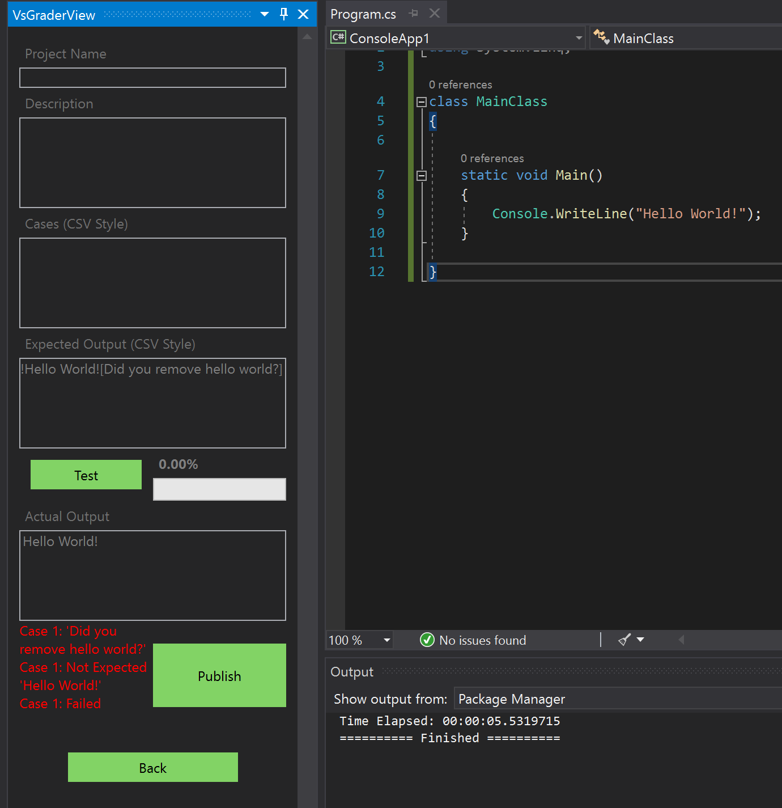
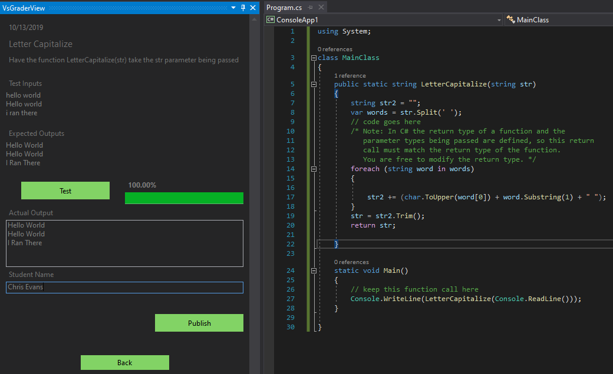
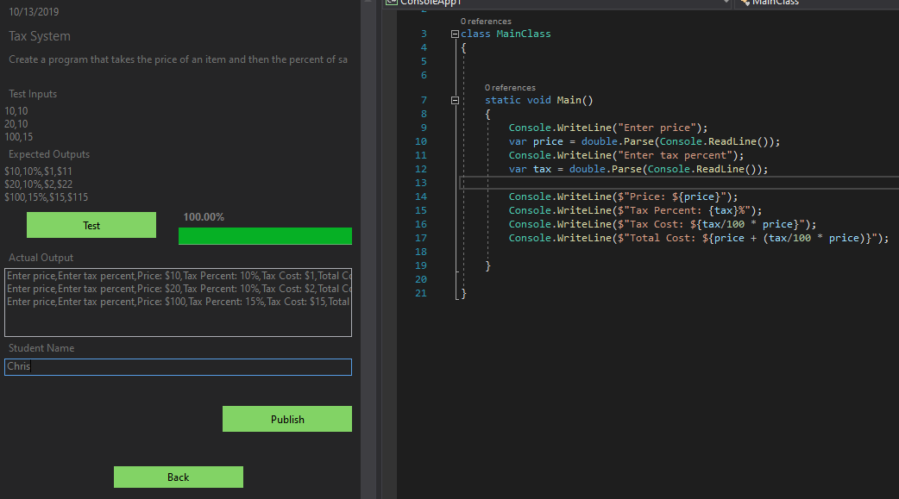
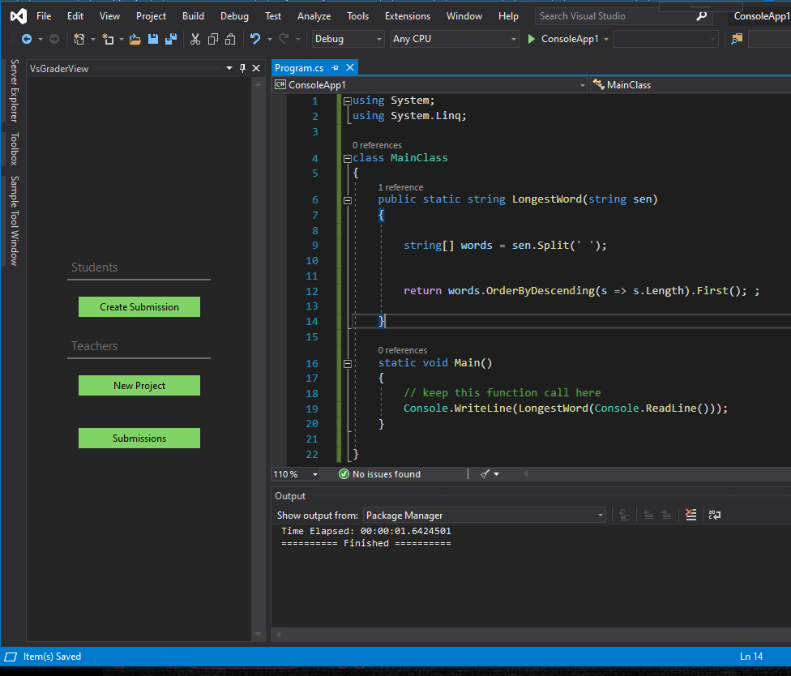
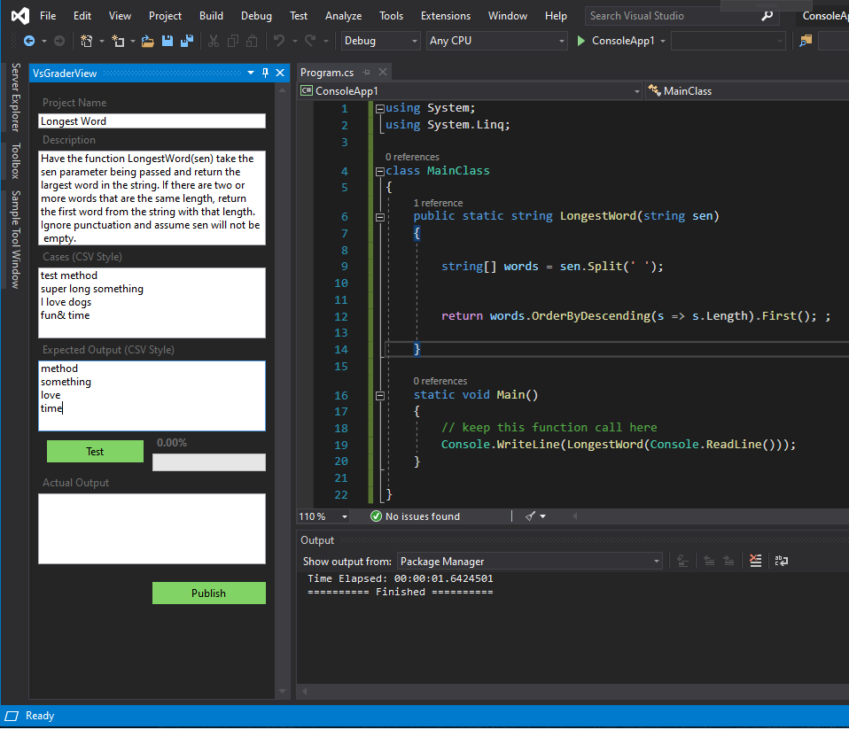
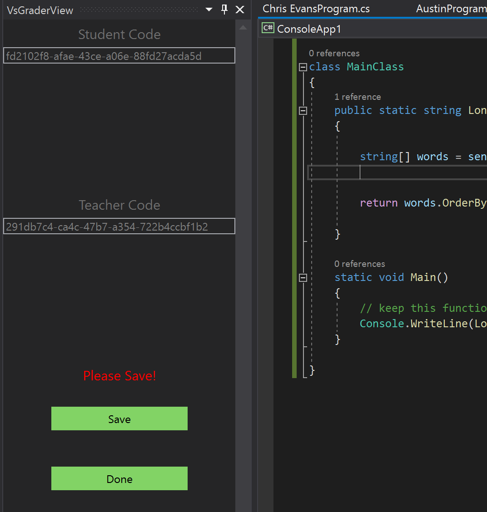
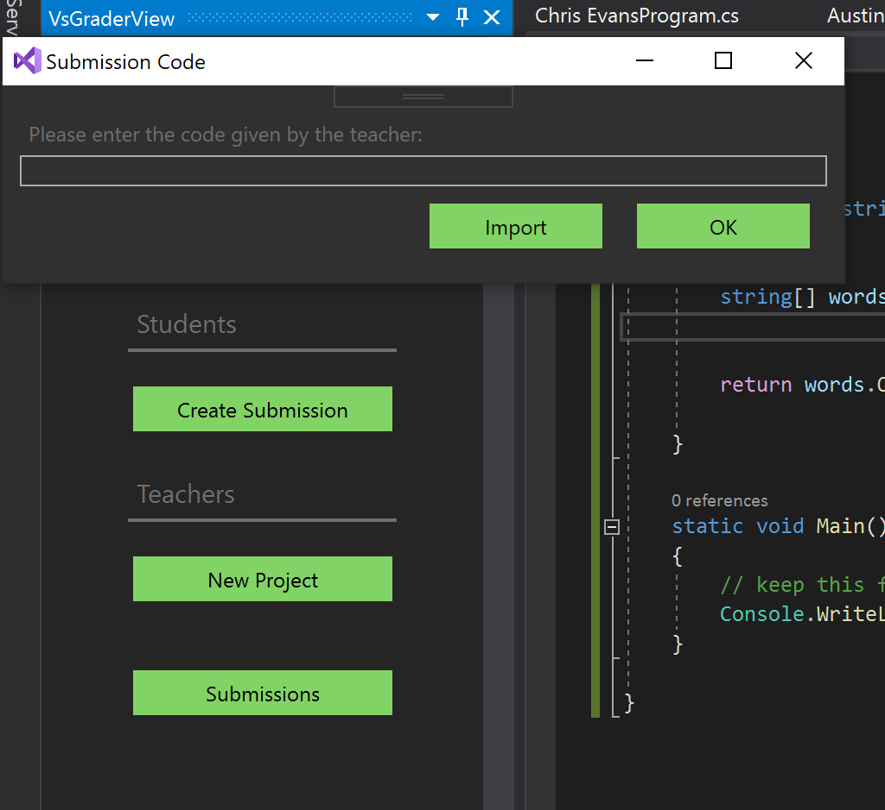
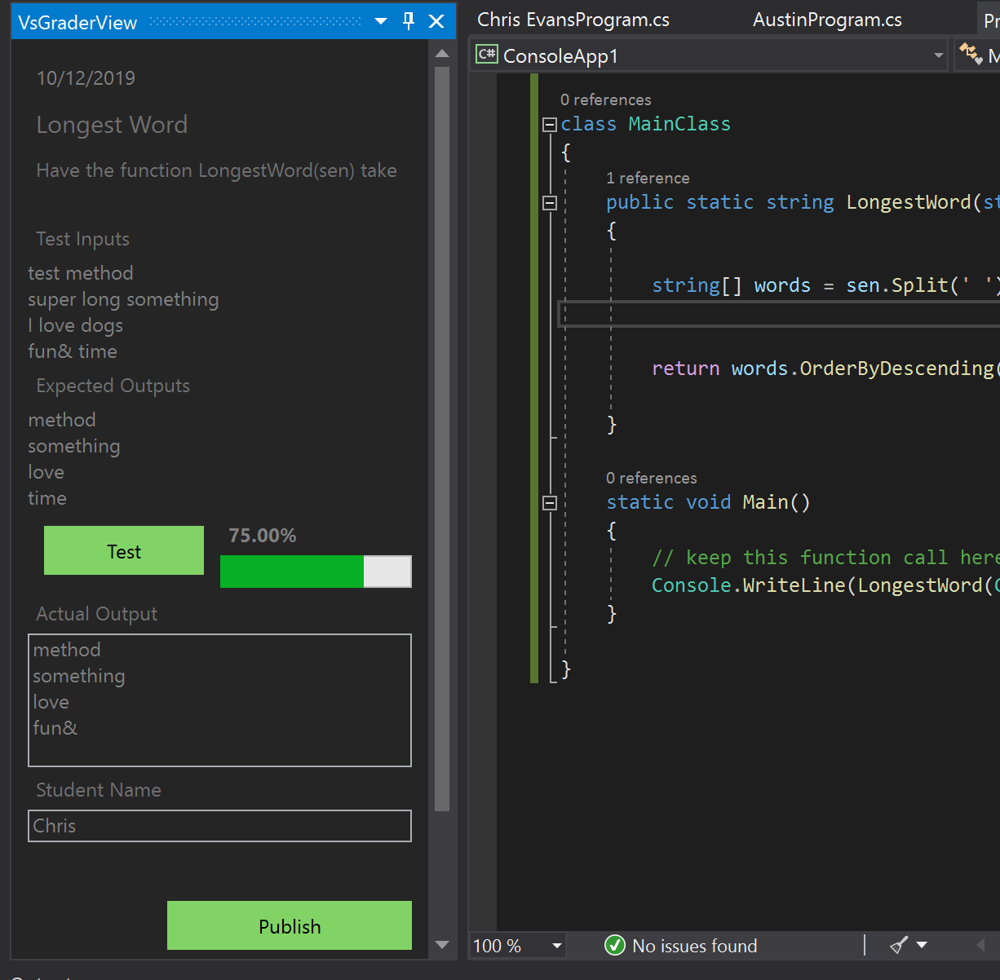
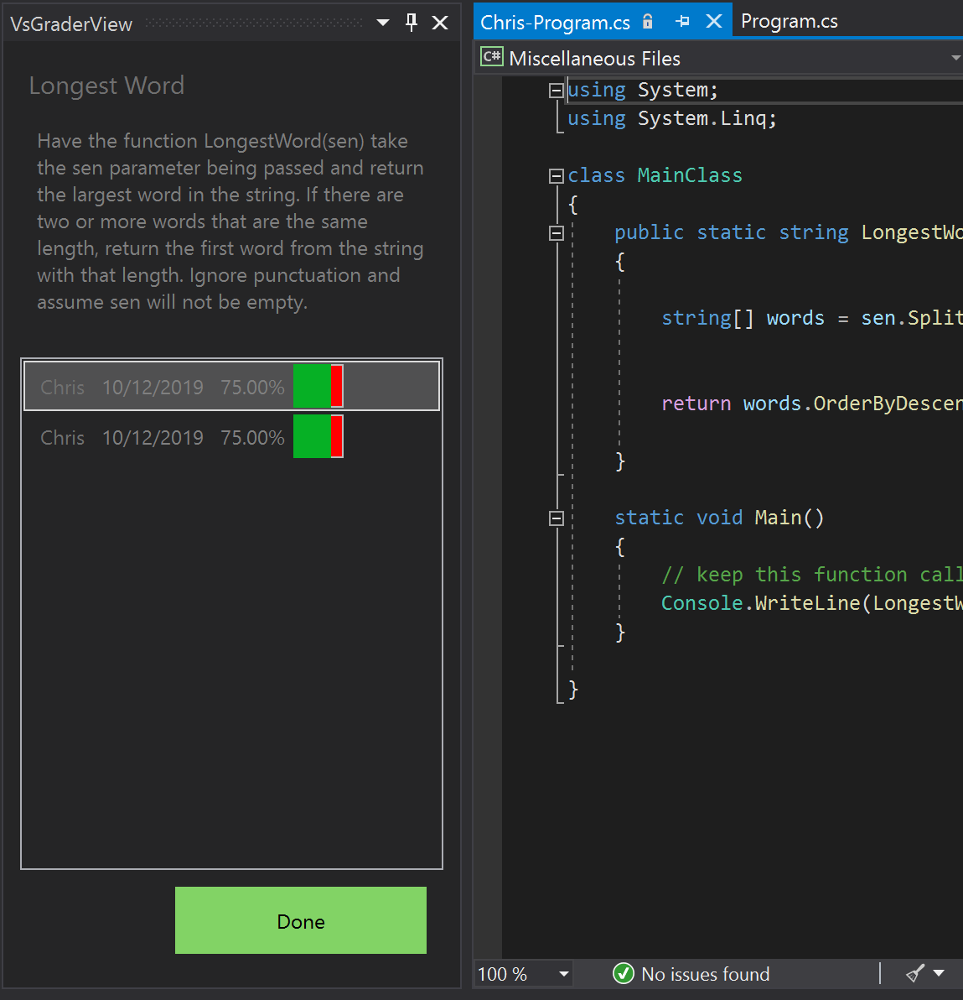

# Visual Studio GradeBook
Simplyifing grading code in visual studio.  No more sending compressed files, downloading, and opening student's code.

Visual Studio Gradebook is a Visual Studio extension that makes it easy for teachers to create projects for students to submit.  Teachers can create cases that students must account for in their console app and teachers can view the student's code right in visual studio.
## Features

- Teachers can create a project for students to complete
  - Teachers can create inputs for their program that will be tested against the student's program.
- When students create the program, they'll be able to test it within visual studio with the inputs the teacher created.  These inputs can be made invisible or visible.
- Students will get a percent of passing cases based on the inputs the teacher provided
- Once the students are finished with their program, 
  they can submit the program within visual studio
- Teachers can then see the submissions from students within visual studio and be able to open the student's submissions from within visual studio.  Teachers then can review the code and see their output and percent passed.

## To Do List
- [x] **Negative Test Cases** Create negative test cases: Cases that should fail, such as throwing exceptions or not showing the expected output
- [x] **Test Hints** Add hints for a test case.  If a test case fails, allow the teacher to put a hint in the error message
- [ ] **Exact Match** Add ability Match the output exactly
- [ ] **Ordered Match** Add ability to create test case that must happen in a certain order.  This could be used to specify that output should occur in a certain order.
- [ ] **Quotations and Commas** Handle commas and quotations in the CSV format.  At the moment, commas cannot be used in test cases 
- [ ] **3rd party assemblies** When testing the console apps, ensure that the dlls referenced in the code are loaded.
- [x] **Improved error messages** Output the expected value when a case fails
- [ ] **Exception Test Cases** create cases that test if a particular input causes or not causes an exception
- [ ] **Test Case Visual Representation** - create a way to see when you are building a project what the cases will look like.  Create a representation that is less "code" like and more gui based.  Give the option to write in csv format or using a gui.
## How to Install

- [Install the Visual Studio Extension Here](https://marketplace.visualstudio.com/items?itemName=EvansSoftware.VsGradeBook)
- To open the view, go to View -> Other Windows -> Vs Grade Book
- To see more details on how to create projects for students, view the problem examples below

## Negation and Hints

In the example below we put ```!Hello World![Did you remove hello world?]``` inside the expected output box.  
**Negation** - The "!" at the beginning of the input negates the expected output.  This means we are looking for an output that is **not** "Hello World!"  
**Hints** - The text in the brackets signifies a hint.  If the test fails to find/negate an expected output, it will output the message in red (see below).  
This allows you to create better and more expressive test cases, such as handling errors.


## Problem Examples
The examples below will show you how this extension works in detail and gives some examples of projects that have been implemented with this extension.  Problems like these can be given to students and used to automate parts of the grading process.
### Letter Capitalize Function

Have the function LetterCapitalize(str) take the str parameter being passed and capitalize the first letter of each word. Words will be separated by only one space.

These inputs can be directly inputed into the program  
**Inputs:**  
hello world  
Hello world  
i ran there  
**Outputs:**  
Hello World  
Hello World  
I Ran There

**Solution:**  
```csharp
using System;

class MainClass {
  public static string LetterCapitalize(string str) { 
    string str2 = "";
    var words = str.Split(' ');
    // code goes here  
    /* Note: In C# the return type of a function and the 
       parameter types being passed are defined, so this return 
       call must match the return type of the function.
       You are free to modify the return type. */
    foreach (string word in words)
    {
        
        str2 += (char.ToUpper(word[0]) + word.Substring(1) + " ");
    }
    str = str2.Trim();
    return str;
            
  }

  static void Main() {  
    // keep this function call here
    Console.WriteLine(LetterCapitalize(Console.ReadLine()));
  } 
   
}
```

[Source](https://coderbyte.com/editor/Letter%20Capitalize:Csharp)



### Tax System (Multiple Inputs Example)

Create a program that takes the price of an item and then the percent of sales tax as inputs in that order.  The program should then output the original price, the tax percent, the tax cost, and the price + tax cost.

**Inputs:**  
10,10  
20,10  
100,15  
**Outputs:**  
$10,10%,$1,$11  
$20,10%,$2,$22  
$100,15%,$15,$115  

```csharp
using System;

class MainClass
{
    

    static void Main()
    {
        Console.WriteLine("Enter price");
        var price = double.Parse(Console.ReadLine());
        Console.WriteLine("Enter tax percent");
        var tax = double.Parse(Console.ReadLine());

        Console.WriteLine($"Price: ${price}");
        Console.WriteLine($"Tax Percent: {tax}%");
        Console.WriteLine($"Tax Cost: ${tax/100 * price}");
        Console.WriteLine($"Total Cost: ${price + (tax/100 * price)}");

    }

}

```

Notice that the expression of the outputs and inputs directly correlate to how they are displayed in the project system.



### Longest Word (Full Example)

Have the function LongestWord(sen) take the sen parameter being passed and return the largest word in the string. If there are two or more words that are the same length, return the first word from the string with that length. Ignore punctuation and assume sen will not be empty.

**Inputs:**  
test method  
super long something  
I love dogs  
fun& time  

**Expected Outputs:**  
method  
something  
love  
time  

**Solution**
```csharp
using System;
using System.Linq;

class MainClass {
  public static string LongestWord(string sen) { 
  
    string[] words = sen.Split(' ');


    return words.OrderByDescending( s => s.Length ).First();;
            
  }

  static void Main() {  
    // keep this function call here
    Console.WriteLine(LongestWord(Console.ReadLine()));
  } 
   
}

```

[Source](https://www.coderbyte.com/editor/Longest%20Word:Csharp)

### Implementation

#### Tasks for the Teacher
Home View/Start Screen

Create a new project view

Store the codes so that you can use them to later grade the submissions.  You can use the save button to create a file that will allow you to import instead of copy and pasting.  The student code can be placed on the assignment created on some class site, such as Canvas or Blackboard.


#### Tasks for the Student

Create a new Submission by entering the code given by the teacher

Create a new submission based on the instructions


#### Submissions for the Teacher
Teacher can now view the submissions in Visual Studio.  It will open the code in the code editor.  From here, the teacher can grade the code in one spot.


## Packages/Tools Used
Here is the main packages used in this project that makes this whole thing work.
### HttpClient/Api packages
- Swashbuckle

### Database
- Sqlite
- EntityFrameworkCore

### Dependency Service
- Unity

### UI
- Xaml
- WPF
- Visual Studio ToolWindow

### Compiler tools
- Microsoft.CodeAnalysis.Analyzers
- Microsoft.CodeAnalysis.CSharp
- Mono.Cecil
- Microsoft.Net.Compilers

### Testing
- Autofixture
- FluentAssertions
- NUnit

## Helpful Resources

- Roslyn Compiler
  - [Analyzing and changing the c# programs](https://github.com/dotnet/roslyn/wiki/Getting-Started-C%23-Syntax-Transformation)
  - [In memory compilation](https://josephwoodward.co.uk/2016/12/in-memory-c-sharp-compilation-using-roslyn)
  - [How to use the CSharp Syntax Rewriter](https://johnkoerner.com/csharp/using-a-csharp-syntax-rewriter/)
  - [Removing Empty Statements with the CSharp Syntax Rewriter](https://joshvarty.com/2014/08/15/learn-roslyn-now-part-5-csharpsyntaxrewriter/)
  - [Roslyn Versions for versions of visual studio](https://stackoverflow.com/questions/45678861/whats-the-latest-version-of-roslyn-my-analyzer-can-target-if-i-support-vs2015?noredirect=1&lq=1)
- VSIX
  - [Visual Studio Extension Samples](https://github.com/Microsoft/VSSDK-Extensibility-Samples)
  - [VSIX Extension Docs](https://docs.microsoft.com/en-us/visualstudio/extensibility/starting-to-develop-visual-studio-extensions?view=vs-2019)
  - [Example of code to add themes to VSIX](https://github.com/madskristensen/KnownMonikersExplorer/blob/master/src/ToolWindows/VsTheme.cs)
  - [Ask Questions about VSIX here](https://gitter.im/Microsoft/extendvs)
  - [Color And Styling](https://docs.microsoft.com/en-us/visualstudio/extensibility/ux-guidelines/colors-and-styling-for-visual-studio?view=vs-2019)
  - [Visual Studio Environment Colors](https://keyoti.com/blog/visual-of-the-actual-colours-in-visual-studios-environmentcolors/)
  - [Developing Visual Studio Extensions](https://michaelscodingspot.com/visual-studio-2017-extension-development-tutorial-part-1/)
- Coding Challenges
  - [Coder Byte](https://coderbyte.com/) 


